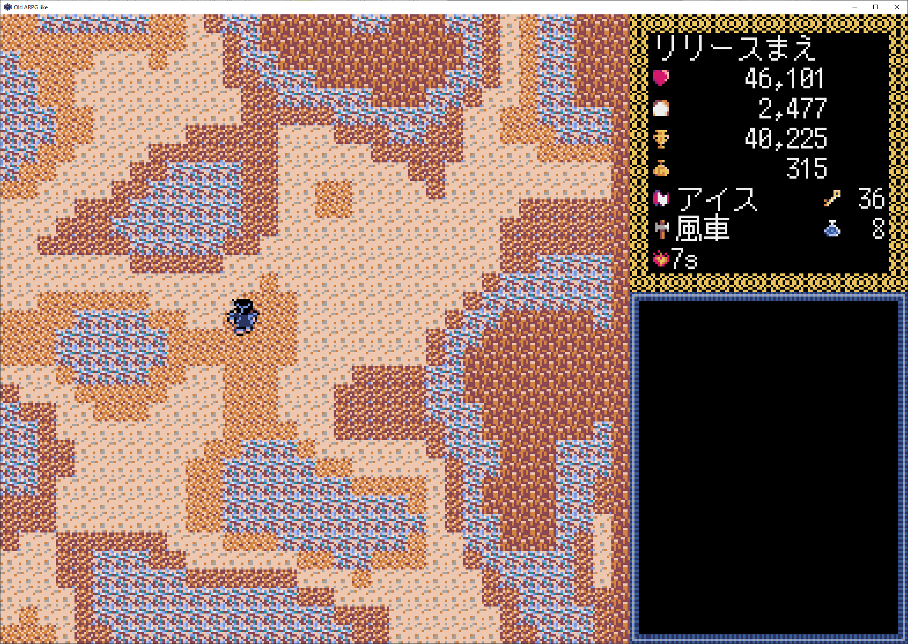
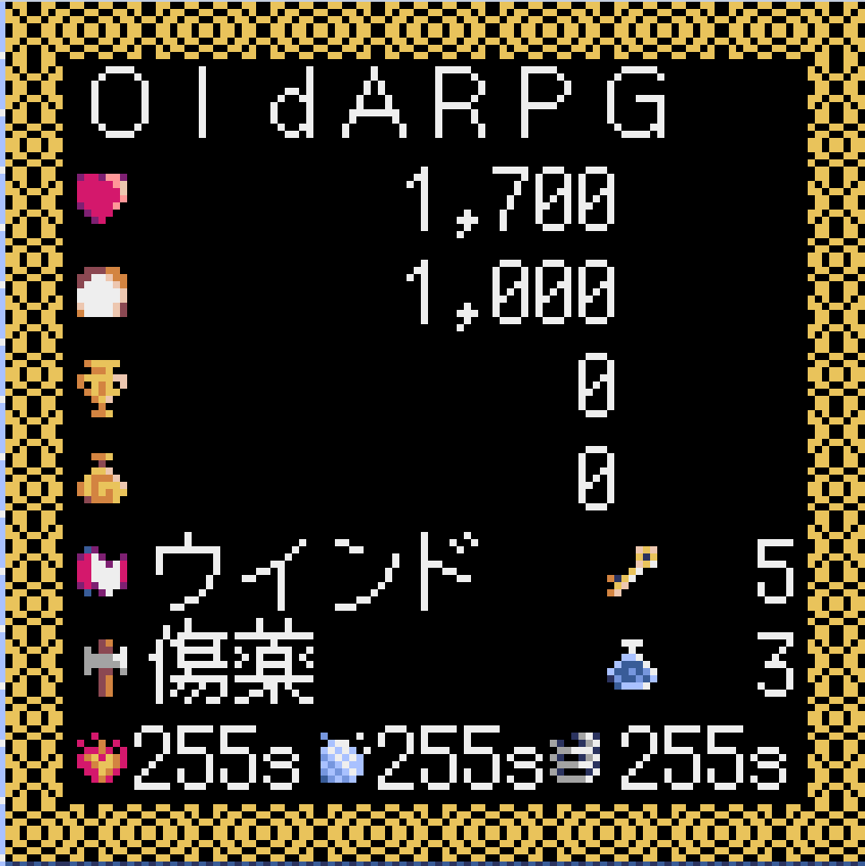
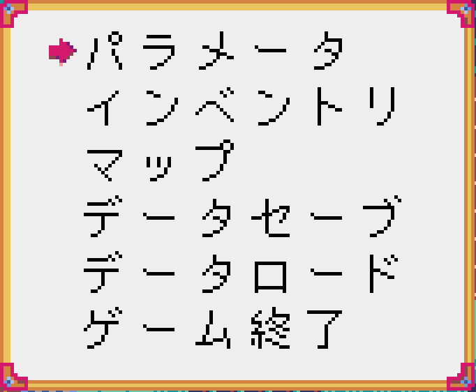
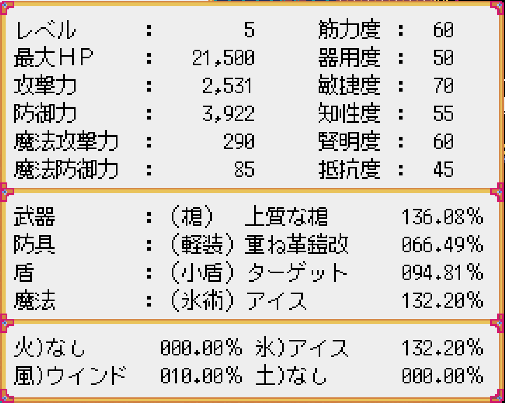
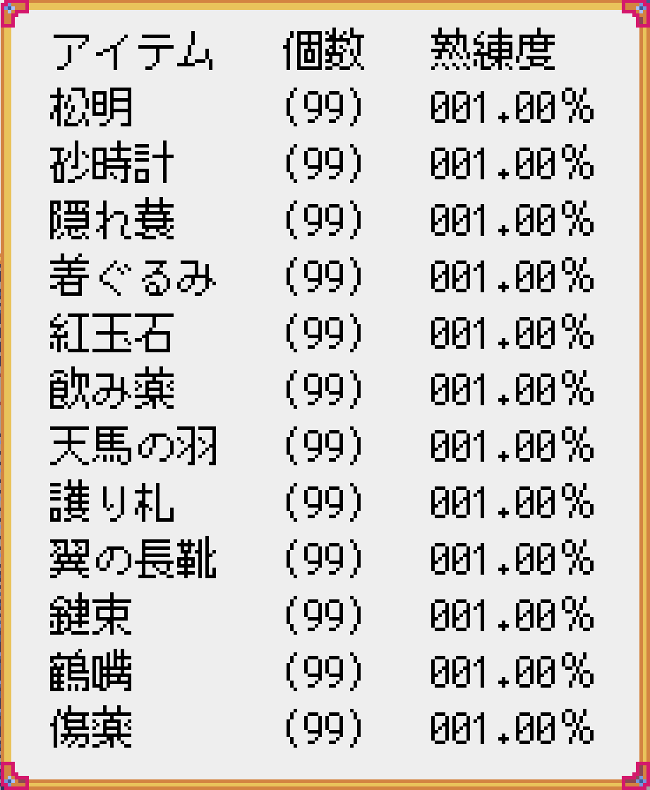
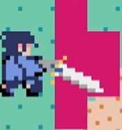
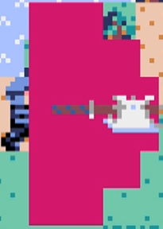

# **Old ARPG like. (by Pyxel)**
 

**※注意※**  
このゲームはWindowsPC専用です。他の環境での動作は保障しません。  
動作検証はWindows10にて行っていますが、Windows11でも動作すると思います。  
 

## **＝　カバーストーリー　＝**  
主人公が目覚めた時、目の当たりにしたのは見た事もない景色でした。  
そして、今がいつで、ここがどこで、そして自分が何者であるか、何故ここに居るのか。全てが思い出せません。  

しかし、ぼんやりしている暇はなさそうです。  
凶悪な雰囲気を漂わせる生物が、姿を隠すでもなく辺りをうろついています。  
あんなものに見つかったらどうなることか！  

ただ直感的に、先に進むべきだと第六感のようなものが囁きかけます。  
右も左も分からない主人公にとって、それは唯一の手掛かりのように思えました。

しかし手にした武器と身に纏う防具、そしてなけなしの食料と道具が主人公の持つ全てです。  
未知の領域を行くには些か不安が残りますが、これらを駆使して道を切り拓く他ありません。  
生存の為にも、行く手を阻む生き物達と戦って勝ち残りましょう！  

そうして辿り着いた先でどんな出来事が待ち受けているのでしょうか。  
どうかその目で見届けてください。  
 
 

## **＝　ゲームの特徴　＝**  
武器を振り、魔法を撃ち、アイテムを使って進む、アクションRPGです。  
敵を倒し、お金やアイテムを集め、経験を積み、主人公は強くなります。  
主人公は戦士、魔法、中間の３タイプから選択します。能力値と初期装備がそれぞれ異なります。  

マップが毎回ランダム生成されるステージを攻略し、ボスを倒して次のステージを目指していきます。  

マップ上に現れる敵は、何度も倒すうちにやがて再出現しなくなります。  
その為、獲得出来る経験値やお金等のリソースには上限が存在します。  

主人公の装備や所持品には熟練度というパラメータが設定されています。  
使えば使う程そのアイテムの扱いに慣れ、より高い効果が発揮出来るようになります。  
値が高くなるにつれ、熟練度はその値が増えにくくなります。  

とても重要なポイントとして・・・  
このゲームは、進め方を誤ると先に進めなくなる可能性があります。  
前述のように敵が有限の為、各ステージでの成長には限界があるからです。  
また、適切なアイテムを所有していない事で明らかに攻略が厳しくなる場面もあります。  

その為、４つのセーブスロットを上手く使い分けて幾つかの状況からやり直せるよう準備する事をお勧めします。  
 
 

## **＝　操作方法　＝**  
### **-= キャラクターの移動 =-**  
* [WASD][↑←↓→][ゲームパッド↑←↓→]
    * ゲーム画面　　　　　　　・・・　自キャラ移動  
      　　　　　　　　　　　　　　　　※防具の重量、自身の行動能力によって速度が変化  
    * メニュー・ショップ画面　・・・　カーソル移動  
   

### **-= アクション =-**  
* [Enter] / [Z] / Aボタン (Xbox)  
    * ゲーム画面　　　　　　　・・・　武器攻撃（長押しで連続実行）  
      　　　　　　　　　　　　　　　　※攻撃完了まで再攻撃・移動不能  
    * メニュー・ショップ画面　・・・　選択を決定  

* [ ］] / [X] / Xボタン (Xbox)   
    * ゲーム画面　　　　　　　・・・　魔法攻撃（長押しで連続実行）  
      　　　　　　　　　　　　　　　　※詠唱完了まで再詠唱・アイテム使用・移動不能  
    * メニュー・ショップ画面　・・・　なし  

* [Space] / [C] / Yボタン (Xbox)   
    * ゲーム画面　　　　　　　・・・　アイテム使用（長押しで連続実行）  
      　　　　　　　　　　　　　　　　※行動完了(極短時間)まで再使用・移動不能  
    * メニュー・ショップ画面　・・・　なし  

* [ESC] / Bボタン (Xbox)   
    * ゲーム画面　　　　　　　・・・　メニューを表示  
    * メニュー・ショップ画面　・・・　キャンセル（一つ前に戻る）  

* [左Shift] / Lボタン (Xbox)   
    * ゲーム画面　　　　　　　・・・　押下中は魔法選択メニューを表示  
    * メニュー・ショップ画面　・・・　なし  

* [右Shift] / Rボタン (Xbox)   
    * ゲーム画面　　　　　　　・・・　押下中はアイテム選択メニューを表示  
    * メニュー・ショップ画面　・・・　なし  
   

### **※Pyxelの標準操作**  
* [Alt(Option)+Enter] またはゲームパッドで [A+B+X+Y+DD]  
    * フルスクリーン表示切替  
   
   

## **＝　ゲームの舞台について　＝**  
ゲームの舞台となるマップにはフィールドとダンジョンが存在し、階段で繋がっています。  
各マップは１画面のエリアが複数繋がって構成されています。  
フィールドにはアイテムが埋まったポイントが、ダンジョンにはアイテムの入った宝箱が設置されています。  
ボスとの戦いでは、専用のバトル画面に移動します。  

エリア内は、レトロゲームらしい小さなブロックの集まりで表現されています。  
中には、進入すると主人公が悪影響を受けるブロックも存在します。  

フィールドの光景はステージによって異なり、侵入不可ブロックの見た目も違います。  
悪影響ブロックの効果もステージによって内容が異なります。  
（例えばステージ１では進入時と一定時間毎に躓いて移動が阻害されます）

ダンジョンには悪影響ブロックは存在しませんが、各所に扉が設けられています。  
扉を開くには鍵が必要となる為、鍵を持たずに部屋を移動すると脱出出来なくなるかも知れません。  
 
 

## **＝　画面の説明　＝**  
| 画面イメージ | 各部の説明 | 
|:-----------|:------------|  
||1.メインウインドウ 　ゲームプレイの中心となる画面。 　キャラクタはこの範囲で操作します。  2.ステータスウインドウ 　主人公の現在の状態を表示します。  3.メッセージウインドウ 　ゲーム中に起きた出来事について 　カラーで表示します。|
 

### **＝　ステータスの説明　＝**  
| 画面イメージ | アイコンの意味 | 
|:-----------|:------------|  
|  | キャラの名前    ・・・現在のＨＰ   ・・・食料の所持数   ・・・累計獲得経験値   ・・・所持金   ・・・選択中の魔法   ・・・選択中のアイテム   ・・・鍵の所持数   ・・・霊薬の所持数   ・・・火術デバフ効果時間   ・・・氷術デバフ効果時間   ・・・風術デバフ効果時間　　 |  

#### **-=　食料について　=-**
主人公は一定間隔毎に食料を消費します。消費量は、最大ＨＰが増える程多くなります。  
食料消費のタイミングでは、消費と同じ値だけＨＰが回復します。  
反対に、食料の所持数が0になると消費のタイミングでＨＰが減少していきます。  
 
 

### **＝　メニューの説明　＝**  
| 画面イメージ | 各項目の説明 | 
|:-----------|:------------|  
|  |パラメータ　　・・・　主人公の現在の能力を表示。   インベントリ　・・・　主人公の所持品情報を表示。   マップ　　　　・・・　進入済のフィールドエリアのミニマップを表示。 　　　　　　　　　　　自分の位置を中心に周囲８画面分を表示。 　　　　　　　　　　　ダンジョンでは表示不能。   データセーブ　・・・　ゲームの進行状況を保存。４箇所に保存可能。   データロード　・・・　ゲームの進行状況を復旧。ロード後は 　　　　　　　　　　　メッセージウインドウは初期化。   ゲーム終了　　・・・　アプリケーションを終了。   |
 

### **＝　パラメータ（能力値）の説明　＝**  
   
レベル　　　・・・　主人公の強さの目安   
筋力度　　　・・・　力の強さ。物理攻撃力に影響。   
器用度　　　・・・　扱いの上手さ。物理攻撃や宝箱を開ける速度に影響。   
敏捷度　　　・・・　体の機敏さ。行動速度（頻度）に影響。   
知性度　　　・・・　知識の深さ。魔法での攻撃距離や威力に影響。   
賢明度　　　・・・　思考の明敏さ。アイテム効果や持続時間、魔法効果(後述)の発動率、魔法詠唱速度に影響。   
抵抗度　　　・・・　魔法に耐える力。受けた魔法攻撃のダメージと効果発動率の軽減に影響。   
※ 各能力度の最大値は255  
最大ＨＰ　　・・・　ＨＰ（攻撃を受け止める力）の最大値。   
攻撃力　　　・・・　物理攻撃で与えるダメージ。筋力度、武器の性能と熟練度から算出。   
防御力　　　・・・　物理攻撃のダメージ減少。防具の性能と熟練度から算出。   
魔法攻撃力　・・・　魔法攻撃で与えるダメージ。知性度、魔法の性能と熟練度から算出。   
魔法防御力　・・・　魔法攻撃のダメージ減少。抵抗度、盾の性能と熟練度から算出。   

武器　　　　・・・　装備中の武器の種類と名称、熟練度。種類別の特徴については後述。  
防具　　　　・・・　装備中の防具の種類と名称、熟練度。種類別の特徴については後述。  
盾　　　　　・・・　装備中の盾の種類と名称、熟練度。種類別の特徴については後述。  
魔法　　　　・・・　所有する魔法のうち、装備中の魔法と属性と熟練度。  

火）　　　　・・・　所有する火術の魔法とその熟練度。種類別の特徴については後述。  
氷）　　　　・・・　所有する氷術の魔法とその熟練度。種類別の特徴については後述。  
風）　　　　・・・　所有する風術の魔法とその熟練度。種類別の特徴については後述。  
土）　　　　・・・　所有する土術の魔法とその熟練度。種類別の特徴については後述。  
 

### **＝　インベントリ（所持品）の説明　＝**  
| 画面イメージ | 各項目の説明 | 
|:-----------|:------------|  
|  | アイテム　・・・　所持品の名称。 　　　　　　　　　各アイテムの効果については後述。 　　　　　　　　　効果発動中のアイテム名には*表示    個数　　　・・・　所持数。 　　　　　　　　　0個の場合でも熟練度を表示。    熟練度　　・・・　所持品の熟練度。 　　　　　　　　　アイテムの効果に影響。    |
 

### **-=　武器種別の特徴　=-**  
杖　　・・・　全てにおいて非力だが、唯一魔法攻撃力上昇補正を持つ。攻撃速度も速い。  
　　　　　　　  
剣　　・・・　射程が少し短い以外に欠点のない、バランスの取れた武器。  
　　　　　　　  
槍　　・・・　射程の長さと引き換えに攻撃力、速度、範囲、ノックバック距離は控えめ。  
　　　　　　　  
斧　　・・・　最大の攻撃力とノックバック距離、範囲を持つが、速度が非常に遅い。  
　　　　　　　  
 

### **-=　防具種別の特徴　=-**  
衣服　・・・　移動速度が速い代わりに防御力が低い。魔法を全く阻害しない。  
軽装　・・・　防御力が控えめな分、速度や魔法阻害のバランスが取れた防具。  
中装　・・・　防御力は高めだが移動速度が低く魔法を阻害する。  
重装　・・・　最高の防御力と引き換えに移動速度と魔法阻害が最低レベル。  
 

### **-=　盾種別の特徴　=-**  
腕輪　・・・　魔法防御力は高いがノックバック軽減性能がゼロ。攻撃速度に影響しない。  
小盾　・・・　高めの魔法防御力以外の性能は控えめ。攻撃が少し遅くなる。  
中盾　・・・　魔法防御力は控えめだがノックバック距離が大幅に短くなる。攻撃が遅くなる。  
大盾　・・・　魔法防御力は非常に低いがほぼノックバックしない。攻撃がかなり遅くなる。  
 

### **-=　魔法種別の特徴　=-**  
火術　・・・　攻撃範囲が広く投射速度の速い魔法弾を放つ。攻撃力は高め、詠唱完了は早い。  
　　　　　　　魔法効果の抵抗に失敗した相手は、一定時間毎秒現HPの2%のダメージを受ける。  
氷術　・・・　前方を扇形に攻撃する。多段ヒット可能。攻撃力は低め、詠唱完了はやや遅め。  
　　　　　　　魔法効果の抵抗に失敗した相手は、一定時間移動速度が半減し、毎秒現HPの0.1%のダメージを受ける。  
風術　・・・　画面全体を攻撃する魔法。多段ヒット可能。攻撃力は低く、詠唱完了も遅い。  
　　　　　　　魔法効果の抵抗に失敗した相手は、一定時間攻撃間隔が遅延する。  
土術　・・・　攻撃範囲が小さく低速だが強力な魔法弾を放つ。詠唱完了は早め。  
　　　　　　　魔法効果の抵抗に失敗した相手は、長距離のノックバック効果を受け弾き飛ばされる。  
**※ 装備している魔法によって魔法効果の効果時間を減少可能。
 
 

## **＝　アイテムの効果　＝**  
### **＜取得時すぐに効果があるもの＞** 
金床　　　・・・　筋力度が10増える。但し最大値は255。  
手袋　　　・・・　器用度が10増える。但し最大値は255。  
粉薬　　　・・・　敏捷度が10増える。但し最大値は255。  
書物　　　・・・　知性度が10増える。但し最大値は255。  
十字架　　・・・　賢明度が10増える。但し最大値は255。  
手鏡　　　・・・　抵抗度が10増える。但し最大値は255。  
宝珠　　　・・・　最大ＨＰが5%増える  
### **＜使用後一定時間効果を発揮するもの＞**  
松明　　　・・・　ダンジョンを照らす。効果消失が近くなると点滅する。  
砂時計　　・・・　敵が移動しなくなる。接触時も攻撃されない。  
隠れ蓑　　・・・　敵がこちらを見失い、ランダム移動を始める。接触時も攻撃されず、魔法も撃たない。  
着ぐるみ　・・・　敵に接触しても攻撃されないが、魔法攻撃は受ける。  
宝石　　　・・・　筋力度が2倍になる。但し最大値は255。  
飲み薬　　・・・　知性度が2倍になる。但し最大値は255。  
風車　　　・・・　敏捷度が2倍になり、移動速度が少し上昇。但し最大値は255。  
お守り　　・・・　抵抗度が2倍になる。但し最大値は255。  
**※効果時間は賢明度と該当アイテムの熟練度で決定され、連続使用で効果時間を延長出来る。但し最大値は255秒。**  
### **＜使用時即時効果を発揮するもの＞**  
鍵束　　　・・・　画面内の扉を全て開く。ダンジョンでのみ使用可能。  
鶴嘴　　　・・・　採取ポイントのアイテムを取得できる。フィールドでのみ使用可能。  
傷薬　　　・・・　HPを回復する。回復量は賢明度と熟練度と最大ＨＰにより決定される。  
### **＜状況に応じて自動で使用されるもの＞**  
鍵　　　　・・・　ダンジョンの扉を開く。  
霊薬　　　・・・　ＨＰ最大で復活する。ボス戦では無効。  
 
 

## **＝　ショップの種類　＝**  
装備品店　・・・　武器、防具、盾、魔法を販売（左右キーで商品リスト切替）。魔法以外は、ステージ毎に販売品が変化。  
消耗品店　・・・　食料、鍵を販売。数量指定は不可能。食料はまとめ買い項目あり。  
宿屋　　　・・・　宿泊し、ＨＰを最大まで回復。掛けられた魔法効果も解除する。  
神殿　　　・・・　参拝し祈りを捧げた時、経験値が一定値に達しているとレベルが上がる。  

### **-=　レベルアップについて　=-**  
レべルアップすると、各能力度が5上昇。最大ＨＰが「アップ後のレベル－ステージ数×2000」上昇する。  
能力度の上昇に伴い、攻撃力や行動速度等も変化する。  
また、宿屋の宿泊費、鍵の売価が(加速度的に)上昇する。  
 
 

## **＝　ゲームの進め方　＝**  
本格的にゲームを進める前に、選択したキャラの動きの確認をお勧めします。  
移動や攻撃、魔法、それぞれ試してみて、フィーリングに合ったものを選んだ方がよいでしょう。  
初期能力の違いはそのまま最後まで育成した時の違いとして現れます。  
一番性能が低い装備は装備品店へ行けば無料で買い替え出来るので、ここで試すのも一つの手です。  

お気に入りキャラが決まったら、いよいよ本腰をいれてプレイです。  
まずは、弱そうな敵を探しましょう。こちらに襲い掛かって来ない敵が戦い易そうです。  

画面内の最後の敵を倒すと、宝箱を落とします。全ての敵は、それぞれ決まったアイテムを持っています。  
中にはまとまったお金や食料を持っている敵も存在する為、これらを集める事が攻略のポイントになります。  
但し、宝箱に魔法を当てると消滅してしまい、中身が手に入らなくなります。  
また、主人公が開けられない（進入できない）場所に宝箱が出現した場合は、魔法で壊すしかなくなります。  
※宝箱の消滅後に画面が切り替わると、敵が再出現します。これを利用した安全確保も。。。  

お金が貯まったら、最初は武器を買う事をお勧めします。防具はある程度立ち回りでカバー出来るでしょう。  
但し、頻繁に買い替えする事はお勧め出来ません。新しい装備を身に着けると、熟練度が半減するからです。  
また、少し強い程度の装備なら、熟練度低下により一時的に能力が下がってしまう事も有り得ます。  

経験値が貯まったら、神殿で祈ってレベルアップ・・・するのは少し待って下さい。  
レベルアップする事で、宿の宿泊費と鍵の値段が上昇します。  
鍵を持つ敵は非常に少ない為、ダンジョン攻略には鍵の購入が欠かせません。  
ダンジョンでしか手に入らないアイテムもある為、ダンジョン攻略は無視出来ない要素です。  
レベルを上げる前に鍵を、なるべく沢山買っておく事をお勧めします。

防具や盾の熟練度はダメージを受ける程熟練度が増加しますが、無闇に敵の攻撃を受けるべきではありません。  
回復にお金が掛かった結果買い物が出来ず、更に戦闘が厳しくなって資金枯渇、というケースも有り得ます。  
また、防具を買い替えたはいいが敵が全て全滅しているようでは熟練度をあげられません。  
意図的に何種類かの敵を残しておくのもまた作戦です。  

フィールドに居るいずれかの敵が、ステージボスを召喚する為のオーブを隠し持っています。  
探し出す為にはあちこちで様々な敵と戦う事になるでしょう。  
運よくオーブを見つけられたら、触れる事でボス戦専用ステージに移動してのバトルが始まります。  
負けてしまった時の為に、直前状態でセーブしておくのがよいでしょう。  
装備の見直しの為に、買い物前にセーブするのも作戦のひとつです。  
 

旅を終える為の最後の試練では、ダンジョンに隠された特別な武器が必要です。  
しかし見つけたからと言ってすぐ手にすると、困った事になるかも知れません。  
複数の状況でセーブデータを残しておくよう、くれぐれも注意して下さい。  
   
   

## **＝　困った時は・・・　＝**  
- 移動が遅すぎる！  
  重い防具を着ていると移動速度が低くなります。軽い防具に買い替えるのが簡単な解決策です。  
  レベルアップや運よく粉薬の入手により敏捷度が上がれば、行動速度の上昇でカバーできるようにもなります。  
  防御力は欲しいが移動速度も、という場合には風車のアイテムも有効です。  
- 敵にダメージを与えられない！  
　繰り返し攻撃や魔法を使う事で熟練度が上がり、ダメージを与えられるかも知れません。  
　宝石や飲み薬で大きく攻撃力を上げる事も出来ます。  
　それでも敵の防御性能を越えられなければ、武器や魔法を買い替える必要もあるでしょう。  
- 熟練度が上がらない！  
　熟練度は、攻撃や魔法が失敗したり、攻撃されてもダメージを受けなかった場合には基本的に上昇しません。  
　確率で上昇する場合がありますが、一定の熟練度以上では非常に低い確率となります。  
　あまりにダメージが与えられない敵を攻撃し続けていては中々熟練度が増えません。  
　そんな時は別の相手を選ぶ事も重要な作戦です。  
- 敵に魔法が効かない！  
　敵は魔法に対する耐性を持っている場合があります。  
　攻撃力をあげても魔法が防御される場合には、違う魔法を使ってみましょう。  
- 敵の攻撃や魔法が強すぎる！  
　防御系熟練度を上げても大きなダメージを受ける場合は、アイテムを使うとよいでしょう。  
　砂時計で動きを止めたり、隠れ蓑で攻撃されない状況を作り出したり。  
　魔法に対しては、お守りを使ってダメージの軽減を図るのも有効です。  
- 地形効果が厄介！  
　地形効果は、着ぐるみを纏う事で無効化できます。  
　ただし、武器での攻撃が出来なくなる為注意が必要です。  
- どうにも進められなくなった・・・  
　まずは手持ちのアイテムを駆使して切り抜けられないか試してみましょう。  
　戦闘なら砂時計と宝石、探索なら鍵束や鶴嘴等。
　苦手な魔法、非力な杖も、極限の状況を切り拓く一手になるかも知れません。

　それよりも、このような状況になってしまわないよう、セーブするタイミングやデータを分ける事が重要です。  
　ステージ開始直後、装備品購入の前、ボスとの戦闘直前などは、大きな変化のポイントです。  
 
 
 

このゲームは古いパソコン時代のARPGを意識して作りました。  
触れてくれた人が居たら、そしてその人が懐かしいと感じてくれたら、とても嬉しいです。  
 

Copyright (c) 2025 MoQ  All rights reserved.  
Pyxel  (c) 2018-2025 Takashi Kitao  
8bit BGM generator (c) @frenchbread1222  

