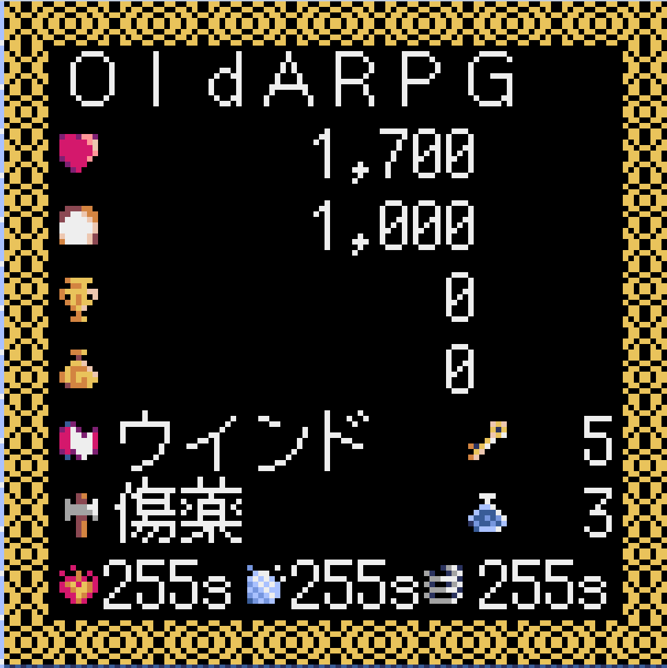
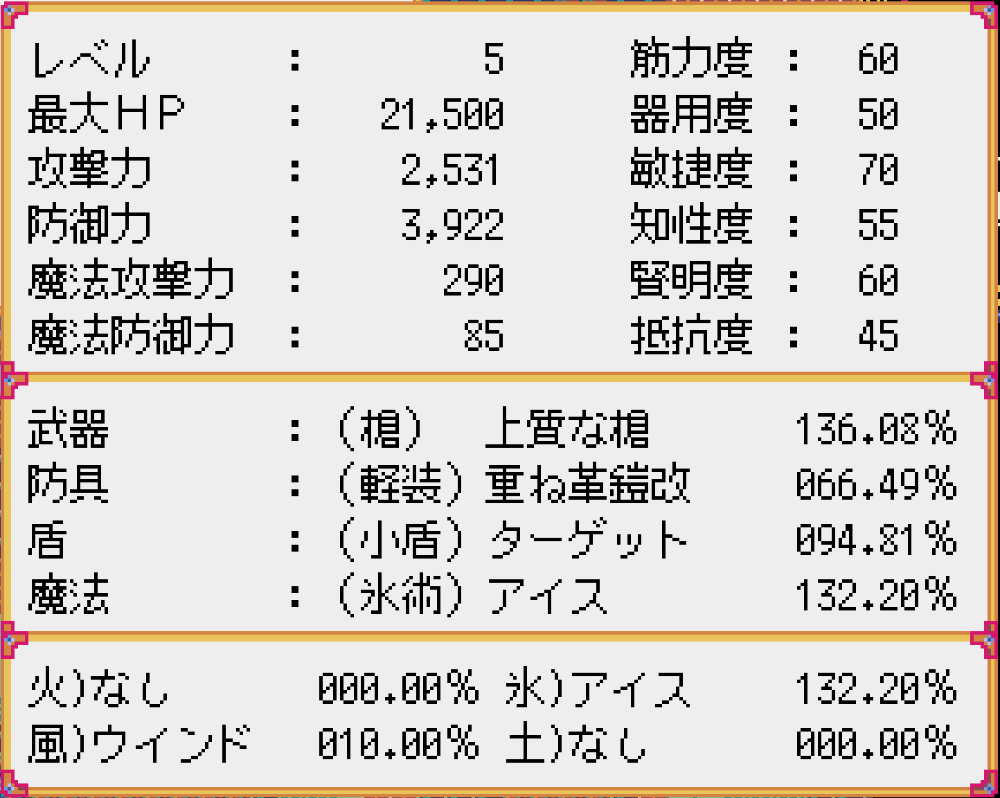
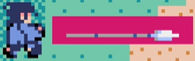

# **Old ARPG like. (by Pyxel)**
 

**※注意※**  
このゲームはWindowsPC専用です。他の環境での動作は保障しません。  
動作検証はWindows10にて行っていますが、Windows11でも動作すると思います。  
 

## **＝　操作方法　＝**  
### **キャラクターの移動**  
* [WASD][↑←↓→][ゲームパッド↑←↓→]
    * ゲーム画面　　　　　　　・・・　自キャラ移動
    * メニュー・ショップ画面　・・・　カーソル移動  
   

### **アクション**  
* [Enter] / [Z] / Aボタン (Xbox)  
    * ゲーム画面　　　　　　　・・・　武器攻撃  
    * メニュー・ショップ画面　・・・　選択を決定  

* [ ］] / [X] / Xボタン (Xbox)   
    * ゲーム画面　　　　　　　・・・　魔法攻撃  
    * メニュー・ショップ画面　・・・　なし  

* [右Ctrl] / [C] / Bボタン (Xbox)   
    * ゲーム画面　　　　　　　・・・　アイテム使用  
    * メニュー・ショップ画面　・・・　キャンセル（一つ前に戻る）  

* [Space] / [ESC] / Yボタン (Xbox)   
    * ゲーム画面　　　　　　　・・・　メニューを表示  
    * メニュー・ショップ画面　・・・　なし  

* [左Shift] / Lボタン (Xbox)   
    * ゲーム画面　　　　　　　・・・　押下中は魔法選択メニューを表示  
    * メニュー・ショップ画面　・・・　なし  

* [右Shift] / Rボタン (Xbox)   
    * ゲーム画面　　　　　　　・・・　押下中はアイテム選択メニューを表示  
    * メニュー・ショップ画面　・・・　なし  
   

### **※Pyxelの標準操作**  
* [Alt(Option)+Enter] またはゲームパッドで [A+B+X+Y+DD]  
    * フルスクリーン表示切替  
   
   

## **＝　ゲームの特徴　＝**  
武器を振り、魔法を撃ち、アイテムを使って進む、アクションRPGです。  
敵を倒し、お金やアイテムを集め、経験を積み、主人公は強くなります。  
主人公は戦士、魔法、中間の３タイプから選択します。能力値と初期装備がそれぞれ異なります。  

マップが毎回ランダム生成されるステージを攻略し、ボスを倒して次のステージを目指していきます。  
マップにはフィールドとダンジョンが存在し、各マップは１画面のエリアが複数繋がって構成されています。  
フィールドにはアイテムが埋まったポイントが、ダンジョンにはアイテムの入った宝箱が設置されています。  

敵は何度も全滅させる事でやがて再出現しなくなります。  
その為、獲得出来る経験値やお金等のリソースには上限が存在します。  
主人公は一定時間毎に食料を消費し、消費し尽くすとＨＰが減少します。その結果・・・  

主人公の装備や所持品には熟練度というパラメータが設定されています。  
使えば使う程そのアイテムの扱いに慣れ、より高い効果が発揮出来るようになります。  
値が高くなるにつれ、熟練度はその値が増えにくくなります。  
効果を発揮しなかった場合は低確率で熟練度が増える場合があります。  

とても重要なポイントとして・・・  
このゲームは、進め方を誤ると先に進めなくなる可能性があります。  
前述のように敵が有限の為、各ステージでの成長には限界があるからです。  
また、適切なアイテムを所有していない事で明らかに攻略が厳しくなる可能性もあります。  

その為、４つのセーブスロットで幾つかの状況からやり直せるよう準備する事をお勧めします。  
ステージ開始直後、装備品購入の前、ボスとの戦闘直前などは、大きな変化のポイントです。  
 

## **＝　プロローグ　＝**  
主人公が目覚めた時、目の当たりにしたのは見た事もない景色でした。  
そして、今がいつで、ここがどこで、そして自分が何者であるか、何故ここに居るのか。全てが思い出せません。  

しかし、ぼんやりしている暇はなさそうです。  
凶悪な雰囲気を漂わせる生物が、姿を隠すでもなく辺りをうろついています。あんなものに見つかったらどうなることか！  

ただ直感的に、先に進むべきだと第六感のようなものが囁きかけます。  
右も左も分からない主人公にとって、それは唯一の手掛かりのように思えました。

しかし手にした武器と身に纏う防具、そしてなけなしの食料と道具が主人公の持つ全てです。  
未知の領域を行くには些か不安が残りますが、これらを駆使して道を切り拓く他ありません。  

辿り着いた先でどんな出来事が待ち受けているのでしょうか。  
どうかその目で見届けてください。  
 

## **＝　ステータスの説明　＝**  
| 画面イメージ | アイコンの意味 | 
|:-----------|:------------|  
|  | キャラの名前    ・・・現在のＨＰ   ・・・食料の所持数   ・・・累計獲得経験値   ・・・所持金   ・・・選択中の魔法   ・・・選択中のアイテム   ・・・鍵の所持数   ・・・霊薬の所持数   ・・・火術デバフ効果時間   ・・・氷術デバフ効果時間   ・・・風術デバフ効果時間  |
 

### **＝　食料について　＝**
一定間隔毎に食料が消費される。  
消費量は、最大ＨＰが増える程多くなる。  
食料消費のタイミングで、消費と同じ値だけＨＰが回復する。  
食料の所持数が0になると、以降食料消費のタイミングでＨＰが減少する。  
 
 

## **＝　パラメータ（能力値）の説明　＝**  
  

レベル　　　・・・　主人公の強さの目安  
筋力度　　　・・・　力の強さ。物理攻撃力に影響。  
器用度　　　・・・　扱いの上手さ。物理攻撃や宝箱を開ける速度に影響。  
敏捷度　　　・・・　体の機敏さ。行動速度（頻度）に影響。  
知性度　　　・・・　知識の深さ。魔法攻撃力に影響。  
賢明度　　　・・・　思考の明敏さ。アイテム効果時間、魔法攻撃の効果発動率に影響。  
抵抗度　　　・・・　魔法に耐える力。魔法のダメージ、魔法効果発動率に影響。  
最大ＨＰ　　・・・　ＨＰ（攻撃を受け止める力）の最大値。  
攻撃力　　　・・・　物理攻撃で与えるダメージ。筋力度、武器の性能と熟練度から算出。  
防御力　　　・・・　物理攻撃のダメージ減少。防具の性能と熟練度から算出。  
魔法攻撃力　・・・　魔法攻撃で与えるダメージ。知性度、魔法の性能と熟練度から算出。  
魔法防御力　・・・　魔法攻撃のダメージ減少。抵抗度、盾の性能と熟練度から算出。  

武器　　　　・・・　装備中の武器の種類と名称、熟練度。種類別の特徴については後述。  
防具　　　　・・・　装備中の防具の種類と名称、熟練度。種類別の特徴については後述。  
盾　　　　　・・・　装備中の盾の種類と名称、熟練度。種類別の特徴については後述。  
魔法　　　　・・・　所有する魔法のうち、装備中の魔法と属性と熟練度。  

火）　　　　・・・　所有する火術の魔法とその熟練度。種類別の特徴については後述。  
氷）　　　　・・・　所有する氷術の魔法とその熟練度。種類別の特徴については後述。  
風）　　　　・・・　所有する風術の魔法とその熟練度。種類別の特徴については後述。  
土）　　　　・・・　所有する土術の魔法とその熟練度。種類別の特徴については後述。  
 

### **＝　武器種別の特徴　＝**  
杖　　・・・　攻撃力と範囲も距離もノックバック距離も短いが、攻撃速度が速く、唯一魔法攻撃力上昇補正を持つ。  
　　　　　　　  
剣　　・・・　射程が少し短い以外に欠点のない、バランスの取れた武器。  
　　　　　　　  
槍　　・・・　最大射程と引き換えに攻撃力、速度、範囲、ノックバック距離は控えめ。  
　　　　　　　  
斧　　・・・　最大の攻撃力とノックバック距離、範囲を持つが、速度が非常に遅い。  
　　　　　　　  
 

### **＝　防具種別の特徴　＝**  
衣服　・・・　移動速度が速い代わりに防御力が低い。魔法を全く阻害しない。  
軽装　・・・　防御力が控えめな分、速度や魔法阻害のバランスが取れた防具。  
中装　・・・　防御力は高めだが移動速度が低く魔法を阻害する。  
重装　・・・　最高の防御力と引き換えに移動速度と魔法阻害が最低レベル。  
 

### **＝　盾種別の特徴　＝**  
腕輪　・・・　魔法防御力は高いがノックバック軽減性能がゼロ。攻撃速度に影響しない。  
小盾　・・・　高めの魔法防御力以外の性能は控えめ。攻撃が少し遅くなる。  
中盾　・・・　魔法防御力は控えめだがノックバック距離が大幅に短くなる。攻撃が遅くなる。  
大盾　・・・　魔法防御力は非常に低いがほぼノックバックしない。攻撃がかなり遅くなる。  
 

### **＝　盾種別の特徴　＝**  
火術　・・・　攻撃範囲が広く速度の速い魔法弾を放つ。効果発動中は毎秒現HPの2%のダメージを与える。  
氷術　・・・　前方扇形範囲を攻撃する魔法。多段ヒット可能。効果発動中は移動速度が半減し、毎秒現HPの0.1%のダメージを与える。  
風術　・・・　画面全体を攻撃する魔法。多段ヒット可能。効果発動中は行動／攻撃間隔が遅延する。  
土術　・・・　攻撃範囲が小さく低速だが強力な魔法弾を放つ。効果が発動すると長距離ノックバックが発生する。  
 

## **＝　アイテムの効果　＝**  
### **＜取得時すぐに効果があるもの＞** 
金床　　　・・・　筋力度が10増える  
手袋　　　・・・　器用度が10増える  
粉薬　　　・・・　敏捷度が10増える  
書物　　　・・・　知性度が10増える  
十字架　　・・・　賢明度が10増える  
手鏡　　　・・・　抵抗度が10増える  
宝珠　　　・・・　最大ＨＰが5%増える  
### **＜使用後一定時間効果を発揮するもの＞**  
松明　　　・・・　ダンジョンを照らす。  
砂時計　　・・・　敵が移動しなくなる。接触時も攻撃されない。  
隠れ蓑　　・・・　敵がこちらを見失い、ランダム移動を始める。接触時も攻撃されず、魔法も撃たない。  
着ぐるみ　・・・　敵に接触しても攻撃されないが、魔法攻撃は受ける。  
宝石　　　・・・　筋力度が2倍になる。但し最大値は255。  
飲み薬　　・・・　知性度が2倍になる。但し最大値は255。  
風車　　　・・・　敏捷度が2倍になる。但し最大値は255。  
お守り　　・・・　抵抗度が2倍になる。但し最大値は255。  
**※効果時間は賢明度と該当アイテムの熟練度で決定される。連続使用で効果時間を延長出来る。但し最大値は255秒。**  
### **＜使用時即時効果を発揮するもの＞**  
鍵束　　　・・・　画面内の扉を全て開く。ダンジョンでのみ使用可能。  
鶴嘴　　　・・・　採取ポイントのアイテムを取得できる。フィールドでのみ使用可能。  
傷薬　　　・・・　HPを回復する。回復量は賢明度と熟練度と最大ＨＰにより決定される。  
### **＜状況に応じて自動で使用されるもの＞**  
鍵　　　　・・・　ダンジョンの扉を開く。  
霊薬　　　・・・　ＨＰ最大で復活する。ボス戦では無効。  
 

## **＝　ショップの種類　＝**  
装備品店　・・・　武器、防具、盾、魔法を販売。魔法以外は、ステージ毎に販売品が変化。  
消耗品店　・・・　食料、鍵を販売。数量指定は不可能。食料はまとめ買い項目あり。  
宿屋　　　・・・　宿泊し、ＨＰを最大まで回復。掛けられた魔法効果も解除する。  
神殿　　　・・・　参拝し祈りを捧げた時、経験値が一定値に達しているとレベルが上がる。  

### **＝　レベルアップについて　＝**  
レべルアップすると、各能力度が5上昇。  
最大ＨＰが「アップ後のレベル－ステージ数×2000」上昇する。  
能力度の上昇に伴い、攻撃力や行動速度等も変化する。  
また、宿屋の宿泊費、鍵の売価が上昇する。  
 
 

## **＝　ゲームの進め方　＝**  
なにより最初にオススメしたいのは・・・選択したキャラの動きの確認です。  
移動や攻撃、魔法、それぞれ試してみて、フィーリングに合ったものを選んだ方がよいでしょう。  
初期能力の違いはそのまま最後まで育成した時の違いとして現れます。  
一番性能が低い装備は装備品店へ行けば無料で買い替え出来るので、ここで試すのも一つの手です。  

お気に入りキャラが決まったら、いよいよ本腰をいれてプレイです。まずは数度の攻撃または魔法でダメージを与えられる敵を探しましょう。  
熟練度が低い武器や魔法では敵にダメージを与えられない場合がありますが、繰り返し挑戦する事で少しずつ熟練度は上がります。  
しかし、あまりにダメージが与えられない敵を攻撃し続けていては中々熟練度が増えません。  
そんな時は別の相手を選ぶ事も重要な作戦です。  

フィールド、ダンジョンそれぞれ１画面には１種類の敵が割り当てられます。  
画面内の最後の敵を倒すと、宝箱を落とします。全ての敵は、それぞれ決まったアイテムを持っています。  
中にはまとまったお金や食料を持っている敵も存在する為、これらを集める事が攻略のポイントになります。  
但し、宝箱に魔法を当てると消滅してしまい、中身が手に入らなくなります。  
また、主人公が開けられない（進入できない）場所に宝箱が出現した場合は、魔法で壊すしかなくなります。  
※宝箱の消滅後に画面が切り替わると、敵が再出現します。  

お金が貯まったら、最初は武器を買う事をお勧めします。防具は立ち回りでカバー出来るでしょう。  
但し、頻繁に買い替えする事はお勧め出来ません。新しい装備を身に着けると、熟練度が半減するからです。  
また、少し強い程度の装備なら、熟練度が下がった結果能力が下がってしまう事も有り得ます。  
買い替えは、お財布と相談しながら数段強い装備を狙ってみて下さい。  

経験値が貯まったら、神殿で祈ってレベルアップ・・・するのは少し待って下さい。  
レベルアップする事で、宿の宿泊費と鍵の値段が上昇します。  
鍵を持つ敵は非常に少ない為、ダンジョン攻略には鍵の購入が欠かせません。  
ダンジョンでしか手に入らないアイテムもある為、ダンジョン攻略は無視出来ない要素です。  
買い物を済ませ、敵を全滅させ、鍵を十分に購入、そしてレベルアップ。  
この流れをボス戦の準備の指針とするとよいでしょう。  

防具や盾の熟練度はダメージを受ける程熟練度が増加しますが、無闇に敵の攻撃を受けるべきではありません。  
回復にお金が掛かった結果買い物が出来ず、更に戦闘が厳しくなって資金枯渇、というケースも有り得ます。  
最大ＨＰの１割を超えないような、ギリギリダメージを受ける敵を選ぶべきです。  
その為に、防具を買い替える直前は敵を全滅させ過ぎない方がいいでしょう。  
 

いずれかの敵は、ステージボスを召喚する為のオーブを隠し持っています。  
探し出す為にはあちこちで様々な敵と戦う事になるでしょう。  
運よくオーブを見つけられたら、触れる事でボス戦専用ステージに移動してのバトルが始まります。  
負けてしまった時の為に、直前状態でセーブしておくのがよいでしょう。  
装備の見直しの為に、買い物前にセーブするのも作戦のひとつです。  

敵は魔法に対する耐性を持っている場合があります。魔法が防御された場合は、違う魔法を使ってみましょう。  

旅を終える為の最後の試練では、ダンジョンに隠された特別な武器が必要です。  
しかし見つけたからと言ってすぐ手にすると、困った事になるかも知れません。  
複数の状況でセーブデータを残しておくよう、くれぐれも注意して下さい。
 
   

古いパソコン時代のARPGを意識して作りました。  
このゲームに触れた人が居たら、そしてその人が懐かしいと感じてくれたら、とても嬉しいです。
 

Copyright (c) 2025 MoQ  All rights reserved.  
Pyxel  (c) 2018-2025 Takashi Kitao  
8bit BGM generator (c) @frenchbread1222  

